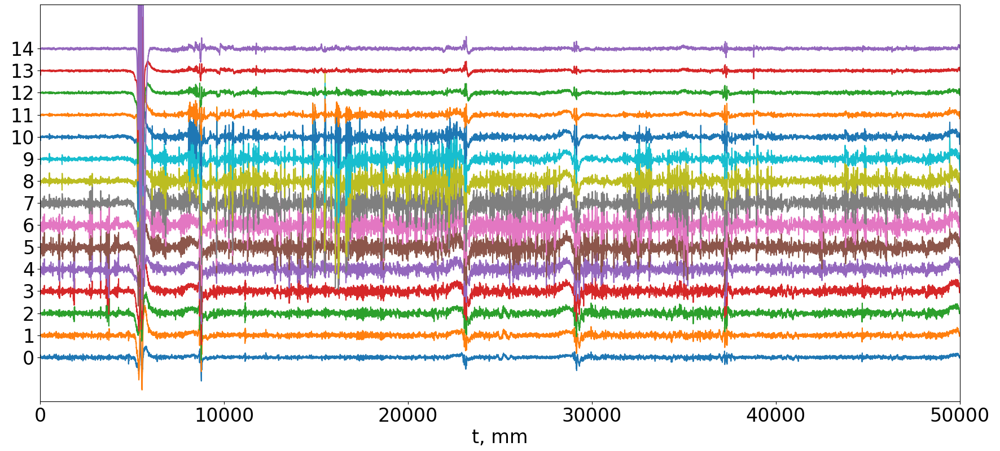
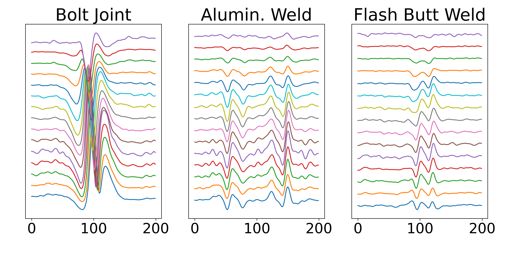
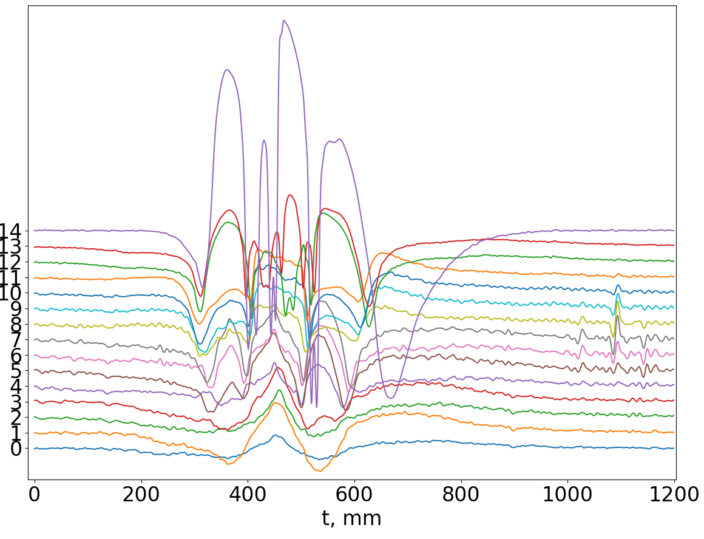
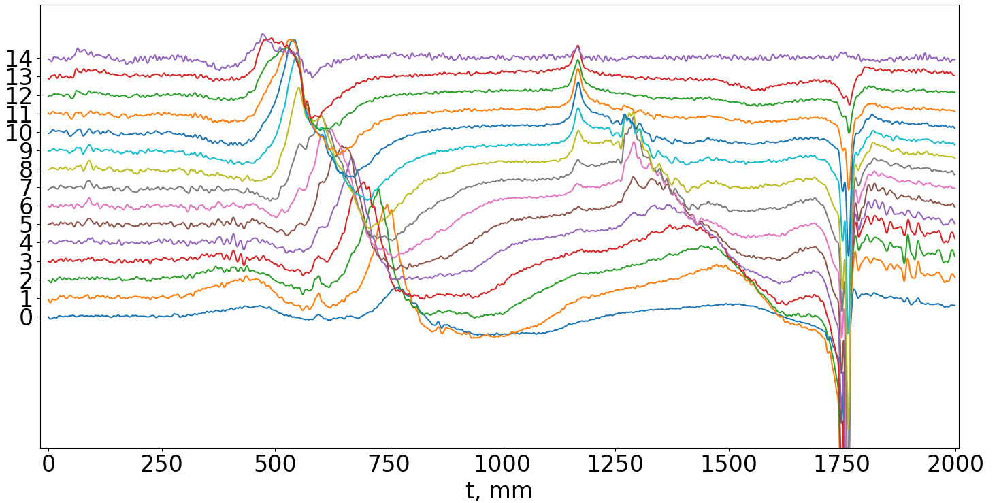
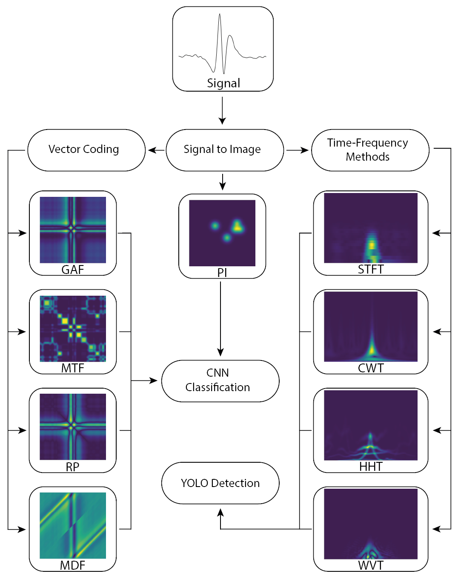

[НАЗАД](../readme.md)

# Вихретоковая дефектоскопия рельсов

Работы в этой области будут посвящены распознаванию образов на сигналах вихретоковых дефектограмм. Может звучать страшно, но физические аспекты всего процесса нас интересовать не будут, да и к самим рельсам мы притрагиваться не будем.

Мы смотрим на эту задачу как на задачу компьютерного зрения.

## Общее описание области исследования

От датчиков мы получаем протяжённый 15 канальный сигнал, который для удобства анализа разделяют на участки по 50 метров. Вот пример такого сигнала:

15 датчиков расположены в линию перпендикулярно направлению движения поезда, они дают информацию о состоянии поверхности рельсов. 

На сигналах присутствуют образы разных элементов на поверхности рельсов. Основными элементами являются:
- Болтовые стыки рельсов. Те самые, которые создают всем знакомый звук постукивания колёс поезда.
- Сварные стыки рельсов двух видов: электроконтактные и алюминотермитные. Они уже звуков создают меньше. Названия происходят от метода создания сварных стыков.

Пример сигналов болтового стыка, алюминотремитной и электроконтактной сварок (слева направо):

- Счётчики осей. Эти элементы позволяют отслеживать положение поездов на участках рельсов. Пример сигнала, соответствующего этому элементу:

- Стрелочные переводы:

- Дефекты и другие элементы.

---

## Задачи и методы решения

Объектом вашего исследования будет применение методов машинного обучения для нахождения таких элементов. 

Для этого предлагается использовать методы компьютерного зрения. Сигнал можно преобразовать в изображение, для этого есть разные методы:
- Методы векторного кодирования
    - Грамиановы угловые поля (Gramian Angular Field, GAF)
    - Рекуррентные изображения (Recurrence Plot, RP)
    - Разностные поля маркова (Markov Transition Field, MTF)
    - полями разности мотивов (Motif Difference Field, MDF)
- Методы частотно-временного преобразования
    - спектрограммы (Short-time Fourier Transform, STFT)
    - скалограммы (Continuous Wavelet Transform, CWT)
    - спектры Гильберта-Хуанга (Hilbert-Huang Transform, HHT)
    - распределения Вигнера-Вилля (Wigner-Ville Distribution, WVD)

**Методы векторного кодирования** из-за размера получаемых изображений можно использовать только в задачах классификации. То есть по картинке определить тип объекта.

**Методы Частотно-временного преобразования** можно использовать как для задачи классификации так и для задачи детекции. То есть обвести в прямоугольник объект на картинке и указать его тип.

---

**Актуальными для исследования** являются все методы векторного кодирования и распределения Вигнера-Вилля, остальные методы частотно-временного преобразования уже исследованы.

[НАЗАД](../readme.md)

