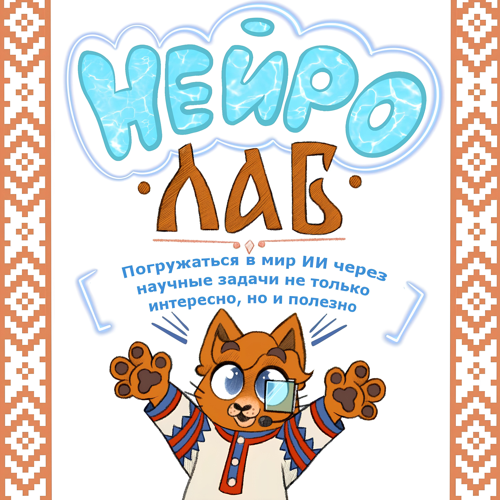
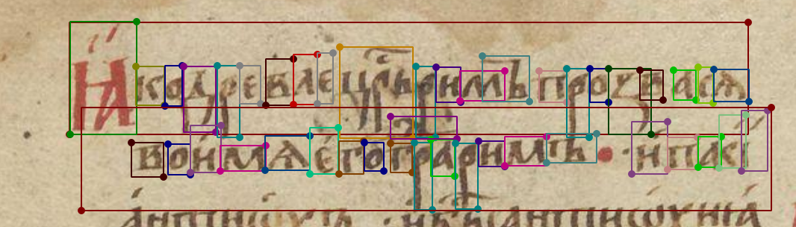

[НАЗАД](../readme.md)

# Распознавание старославянских рукописных текстов.
    
Предполагается работа в рамках студенческой лаборатории "Неролаб"

В рамках которой происходит разработка системы для автоматического распознавания старославянских текстов совместно с историческим факультетом .

Мы сделали [приложение](https://github.com/DemidNeuroLab/NeuroLabel) для разметки текстов. За основу взято приложение для разметки объектов [labelme](https://github.com/wkentaro/labelme) с открытым кодом. В разработанном приложении наши коллеги с исторического факультета подготовят разметку данных: выделят строки с текстом и аннотируют их. А нашей задачей является всячески (программно) им помочь. После того, как будет размечен необходимый набор данных можно будет приступать к следующему шагу $-$ к обучению нейронных сетей для распознавания рукописей.

  
   
  <em>Пример разметки текста.</em>

Распознавание рукописного текста это пример промежуточной задачи машинного обучения. В ней приходится решать задачу детекции строк, для этого применяются свёрточные нейронные сети, и задачу обработки последовательностей слов/букв для извлечения осмысленного текста, для этого применяются языковые модели. 

## Актуальные задачи

### Обучение сети для предварительной разметки данных

Для упрощения работы разметчиков было бы хорошо добавить в приложение функцию для автоматического выделения областей текста и строк. Этому и посвящена эта задача.

Также выделение строк и областей текста потребуется и на этапе извлечения текста из изображения.

Для решения предлагается воспользоваться одной из готовых архитектур сетей, таких как [CRAFT](https://github.com/clovaai/CRAFT-pytorch), [YOLO OCR](https://github.com/aqntks/Easy-Yolo-OCR) и [TrOCR](https://github.com/mars3219/trocr). 

<!-- Побочные задачи:
- Разработка способов аугментации для улучшения качества работы нейронных сетей.

Аугментации - преобразования, направленные на увеличение обучающей выборки, увеличение разнообразия и репрезентативности выборки. -->

Наборы данных для обучения:
- Французские рукописи [Guerin](https://zenodo.org/records/5535306)
- [Рукописная Кириллица](https://www.kaggle.com/datasets/constantinwerner/cyrillic-handwriting-dataset?select=train)
- и [другие](https://www.kaggle.com/search?q=OCR+in%3Adatasets)

### Обучение сети для извлечения текста из строк

Пока эта часть заблокирована отсутствием размеченных данных рукописных текстов. 

Общие шаги по решению таковы: 
- Выделение строк в тексте. Эта задача предполагается быть решённой на предыдущем шаге.
- Выделение из строк текста. Этого в свою очередь можно пытаться добиваться разными способами: 
  - можно выделять символы, отдельно распознавать символы свёрточными сетями, а далее восстанавливать слова из символов. После этого можно применить языковые модели для улучшения качества распознавания слов.
  - можно сразу по выделенной строчке пытаться получить текст. Тут предполагается использование визуальных трансформеров. Этап с явным выделением символов тут можно опустить и далее сразу применять языковые модели для восстановления слов.
- Применение моделей для соединения строк. Шаг необходим для восстановления возможных переносов слов, также этот шаг позволит увеличить общее качество распознавания текста за счёт учёта контекста строк.

[НАЗАД](../readme.md)

